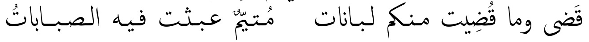
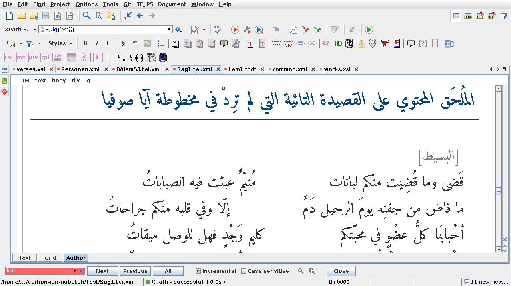

# &lt;ܬܸ݂> for Non-Western Scripts  { data-background-image="noise.gif" }

::: { .attribution .text-left }

Christian Lück, University of Münster

:::


## In this presentation

- The Siglum
- The Verse
- A Line of Escape

# The Siglum { data-background-image="noise.gif" }

## Ibn Nubatah (1287-1366) { .align-top .small }


```{xml}
<rdg wit="#س">وقال</rdg>
```

. . .

::: { .xxsmall }
```{shell}
$ hexdump -C ex2.xml
00000000  3c 72 64 67 20 77 69 74  3d 22 23 d8 b3 22 3e d9  |<rdg wit="#..">.|
00000010  88 d9 82 d8 a7 d9 84 3c  2f 72 64 67 3e 0a        |.......</rdg>.|
```
:::

. . .

::: { style="font-size:1.4em" }

Bidi!

:::

::: { .text-left }

Unicode Standard Annex #9: Unicode Bidirectional Algorithm (Davis et al. 2022)

QUOTE and GREATER-THAN are weak *directional characters*.

:::


## My 2020 Solutions: I { .align-top .small }

::: { .text-left }

Insert *explicit directional embeddings*:


```
<rdg wit="#‪س‬">وقال</rdg>
```
::: { .xxsmall }
```{shell}
$ hexdump -C ex3.xml
00000000  3c 72 64 67 20 77 69 74  3d 22 23 e2 80 aa d8 b3  |<rdg wit="#.....|
00000010  e2 80 ac 22 3e d9 88 d9  82 d8 a7 d9 84 3c 2f 72  |...">........</r|
00000020  64 67 3e 0a                                       |dg>.|
```

```
..., quote, number sign, LEFT TO RIGHT EMBEDDING, arabic letter seen, POP
DIRECIONAL FORMATTING, quote, ...
```
:::

:::: { .xxsmall }

Cons:

- letters you cannot see directly, but only by effect
- easy to break
- As you can guess by the name POP DIRECTIONAL FORMATTING this
  imposes a stack machine or context free grammar on top of XML.

::::
:::

## My 2020 Solutions: II { .align-top .small }

Latinization

```{xml}
<rdg wit="#S">وقال</rdg>
```

- replace arabic IDs/IDREFs with latin IDs/IDREFs
- do not allow arabic script in attributes at all

::: { .text-left }

A sharp tongue's judgement: You solved a problem, that is rooted in
the hegemony of the Global North and in the deep reification of its
culture in techonology, just by deeper assimilation.

:::

# The Verse { data-background-image="noise.gif" }

## Arabic Poetry { .align-top .xxsmall }




```{xml}
<l>قَضى وما قُضِيت منكم لبانات<caesura/>مُتيّمٌ عبثت فيه الصباباتُ</l>
```

- western script: you can read linearly and skip the tags
- rtl script: you have to collect a chopped line back together again
- nothing human eyes were ever trained for in any literate culture

## Theory { .align-top .xxsmall }


```{xml}
<l>قَضى وما قُضِيت منكم لبانات<caesura/>مُتيّمٌ عبثت فيه الصباباتُ</l>
```

- the intermediality of *graphé* and *phoné* (cf. Derrida 1974) is broken
  when encoding non-western script in XML
- read as a diagram, just for recorded sound
- the reification of the European phonocentrism in technology leaves
  other cultures' phonocentrisms broken
- "TEI is good since you can read the source" reveals its foundation in
  Eurocentrism
  

## 2020 (Epidemic) Solution { .align-top .xxsmall }



# A Line of Flight { data-background-image="noise.gif" }

## A Line of Flight { .align-top .xxsmall }

::: { .text-left }

Couldn't we get rid of latin-script tags?

:::

. . .

::: { .text-left }

We could *translate* or *transliterate* the tag names!

:::

. . .

::: { .text-left }


```{xml}
<ل>قَضى وما قُضِيت منكم لبانات<كَِسُرَ/>مُتيّمٌ عبثت فيه الصباباتُ</ل>
```

:::: { .xsmall }
```{shell}
$ hexdump -C ex6.xml
00000000  3c d9 84 3e d9 82 d9 8e  d8 b6 d9 89 20 d9 88 d9  |<..>........ ...|
00000010  85 d8 a7 20 d9 82 d9 8f  d8 b6 d9 90 d9 8a d8 aa  |... ............|
00000020  20 d9 85 d9 86 d9 83 d9  85 20 d9 84 d8 a8 d8 a7  | ........ ......|
00000030  d9 86 d8 a7 d8 aa 3c d9  83 d9 8e d9 90 d8 b3 d9  |......<.........|
00000040  8f d8 b1 d9 8e 2f 3e d9  85 d9 8f d8 aa d9 8a d9  |...../>.........|
00000050  91 d9 85 d9 8c 20 d8 b9  d8 a8 d8 ab d8 aa 20 d9  |..... ........ .|
00000060  81 d9 8a d9 87 20 d8 a7  d9 84 d8 b5 d8 a8 d8 a7  |..... ..........|
00000070  d8 a8 d8 a7 d8 aa d9 8f  3c 2f d9 84 3e 0a        |........</..>.|
```
::::

:::

## Transliteration vs. Translation { .align-top .xxsmall }

```{xml}
<ل>قَضى وما قُضِيت منكم لبانات<كَِسُرَ/>مُتيّمٌ عبثت فيه الصباباتُ</ل>
```

- transliteration replaces characters from one script with characters from the other script
- `l` in `<l>` is replaced with LAM in `<ل>`
- can be applied mechanically
- there is software for transliteration: ICU library
- there is a XPath binding for ICU 


[https://github.com/SCDH/icu-xpath-bindings](https://github.com/SCDH/icu-xpath-bindings)

## Transliterating Tag Names { .align-top .xxsmall }

::: { .xxsmall }

```{xsl}
<?xml version="1.0" encoding="utf-8"?>
<xsl:stylesheet
    xmlns:xsl="http://www.w3.org/1999/XSL/Transform"
    xmlns:xs="http://www.w3.org/2001/XMLSchema"
    xmlns:icu="https://unicode-org.github.io/icu/"
    version="3.0">

   <xsl:param
	   name="transliterator" as="xs:string"
	   select="'NFD; [:nonspacing mark:] Remove; NFC'"/>

   <xsl:mode on-no-match="shallow-copy"/>

   <xsl:template match="element()">
      <xsl:element
		  name="{icu:transliterate(name(.), $transliterator)}">
         <xsl:apply-templates/>
      </xsl:element>
   </xsl:template>

</xsl:stylesheet>
```

:::

```{shell}
$ bindings/target/bin/xslt.sh -config:saxon-config.xml \
   -xsl:doc/transliterate-tags.xsl -s:ex5.xml \
   transliterator=latin-arabic
```

## &lt;altIdent> { .align-top .xxxsamll }

::: { .xxsmall}

- do not transliterate tag names back and forth
- T<sub>arabic_latin</sub> ∘ T<sub>latin_arabic</sub> ≠ id
- T<sub>syriac_latin</sub> ∘ T<sub>latin_syriac</sub> = id
- generate alternative tag names and put them in your ODD with
  `<altIdent>`
  ```{xml}
  <elementSpec ident="l" mode="change">
     <altIdent xml:lang="en_Arab">ﻝ</altIdent>
  </elementSpec>
  ```
- things get more complicated the deeper a thing is rooted in
  the technology stack: `@xml:id`, ...

:::


# References { .align-top .xxsmall }

::: { .xxxsmall }

- Davis, Mark et al. (2022): Unicode Standard Annex #9: Unicode
  Bidirectional Algorithm Latest version:
  https://www.unicode.org/reports/tr9/ Version 15.0.0:
  https://www.unicode.org/reports/tr9/tr9-46.html

- Derrida, Jacques (1974): Grammatologie. Frankfurt/Main: Suhrkamp.

- ICU International Components for Unicode, Documentation,
  https://unicode-org.github.io/icu/
  
- ICU XPath bindings, by Christian Lück, https://github.com/SCDH/icu-xpath-bindings

:::

# Thanks

::: { .attribution .text-left }

christian.lueck@uni-muenster.de

:::
